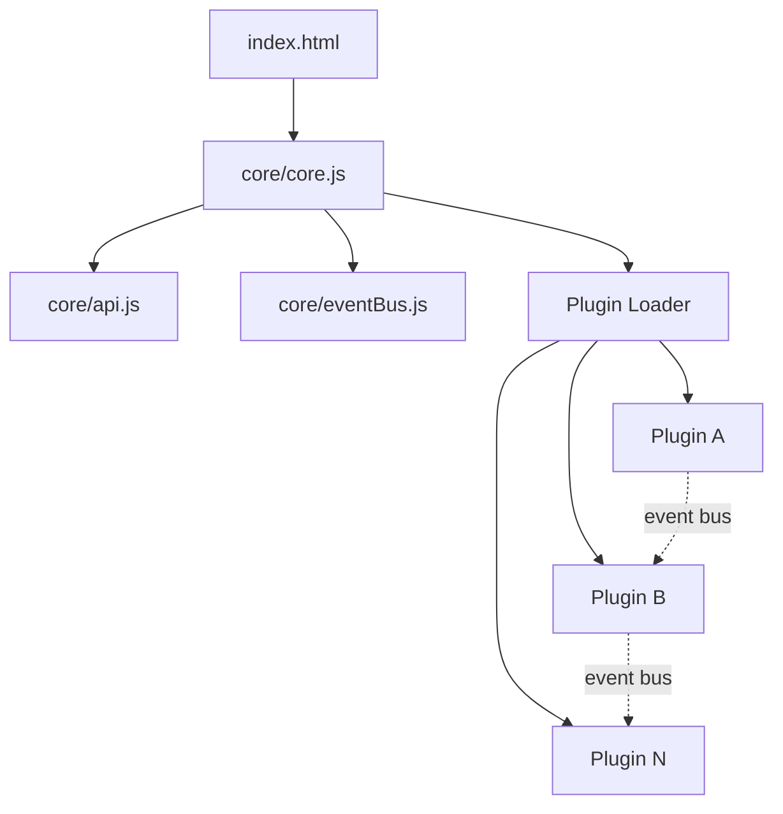

## Overview

Blank Board uses a **micro-kernel** architecture. The kernel handles bootstrapping and plugin loading. Everything else is a plugin.



## Core Files

### `index.html`

The only static HTML file. Contains:

- A `#board` div (100vw × 100vh) with a CSS grid background
- Base styles for `.plugin-box` (positioned, draggable containers)
- A single `<script type="module">` that boots `core/core.js`

```html
<div id="board"></div>
<script type="module" src="core/core.js"></script>
```

### `core/core.js` — Bootstrap

The entry point. On load:

1. Creates the **EventBus** instance
2. Creates a **storage** adapter (localStorage wrapper)
3. Calls `createApi()` to build the plugin API (version `"4.0.0"`)
4. Loads the **plugin registry** from localStorage
5. Auto-installs or re-enables the **Plugin Manager** if missing/disabled
6. Iterates through enabled plugins and loads each via dynamic `import()`
7. Handles CORS by fetching remote plugin code and loading via blob URLs
8. Deduplicates the registry
9. Emits `board:allPluginsLoaded` after all plugins load
10. Attaches management methods (`togglePlugin`, `deletePlugin`, `installPlugin`, `reloadPlugin`, `restart`)
11. Exposes `window.blankBoard = { bus, api }` for debugging

### `core/api.js` — API Factory

Creates the API object passed to every plugin's `setup()` function. Includes:

- Container management (`container` getter, `getContainer`, `mountPlugin`, `undockPlugin`, `updatePlugin`)
- CSS injection (`injectCSS`, `removeCSS`)
- UI systems (toolbar, sidebar, context menu, notifications, modals, shortcuts)
- Hooks system (`registerHook`, `useHook`, `removeHook`)
- Storage (global + plugin-scoped)
- Permissions system
- Drag & resize helpers
- Utility functions (`debounce`, `throttle`)

### `core/eventBus.js` — Event System

A minimal pub/sub with: `on()`, `off()`, `once()`, `emit()`, `removeAll()`.

## Plugin File Format

Every plugin is a standalone ES module:

```javascript
export const meta = {
  id: 'my-plugin',
  name: 'My Plugin',
  version: '1.0.0',
  compat: '>=3.3.0'   // optional
};

export function setup(api) {
  // Initialize your plugin
}

export function teardown() {
  // Optional: clean up on unload
}
```

## Plugin Registry

Stored in localStorage under `board-plugins-registry`:

```json
[
  {
    "id": "plugin-manager",
    "url": "https://raw.githubusercontent.com/dheeraz101/Empty_Plugins/refs/heads/main/plugin-manager.js",
    "name": "Plugin Manager",
    "enabled": true
  }
]
```

### Registry Fields

| Field | Required | Description |
|-------|----------|-------------|
| `id` | ✅ | Unique plugin identifier |
| `url` | ✅ | URL to the `.js` file |
| `name` | ✅ | Display name |
| `enabled` | ✅ | Whether the plugin is loaded |
| `source` | ❌ | `'system'`, `'registry'`, or `'manual'` |

### Lifecycle

| Action | What Happens |
|--------|-------------|
| First load | Plugin Manager auto-installed from GitHub |
| Subsequent loads | Reads from localStorage (persists changes) |
| Install | Appends to registry → saves → dynamic import |
| Toggle off | Calls `teardown()` → removes container → saves |
| Toggle on | Loads via `import()` → calls `setup(api)` |
| Delete | Unloads → removes from registry → saves |
| Restart | Unloads all → reloads all enabled |

## Plugin Loading (CORS Handling)

For cross-origin plugin URLs, the core:

1. Fetches the plugin code via `fetch()`
2. Creates a `Blob` with `application/javascript` type
3. Generates a blob URL via `URL.createObjectURL()`
4. Imports the blob URL
5. Revokes the blob URL after import

This allows loading plugins from any CORS-enabled server (like GitHub raw URLs).

## File Tree

```
├── index.html              # Static shell
├── core/
│   ├── core.js             # Bootstrap & plugin loader
│   ├── api.js              # API factory
│   └── eventBus.js         # Pub/sub system
└── (plugins are hosted externally)
```

<Info>
  Plugins are no longer bundled in the main repository. They live in the [community plugin repo](https://github.com/dheeraz101/Empty_Plugins) and are loaded via URL.
</Info>
