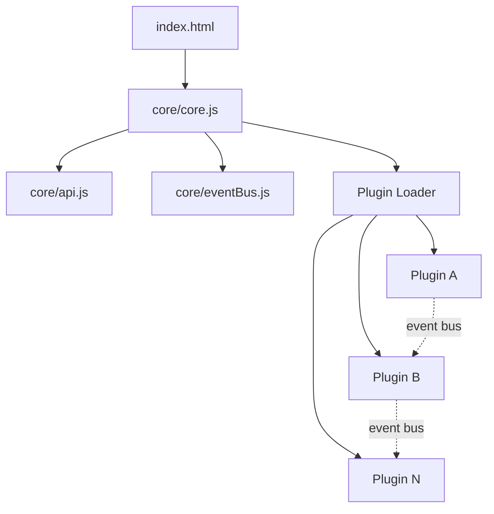

## Overview

Blank Board uses a **micro-kernel** architecture. The kernel handles bootstrapping and plugin loading. Everything else is a plugin.



## Core Files

### `index.html`

The only static HTML file. Contains:

- A `#board` div (100vw × 100vh) with a CSS grid background
- Base styles for `.plugin-box` (positioned, draggable containers)
- A single `<script type="module">` that boots `core/core.js`

```html
<div id="board"></div>
<script type="module" src="core/core.js"></script>
```

### `core/core.js` — Bootstrap

The entry point. On load:

1. Creates the **EventBus** instance
2. Creates a **storage** adapter (localStorage wrapper)
3. Calls `createApi()` to build the plugin API
4. Loads the **plugin registry** from localStorage or `plugins.json`
5. Iterates through enabled plugins and loads each via dynamic `import()`
6. Attaches management methods (`togglePlugin`, `deletePlugin`, `installPlugin`)
7. Exposes `window.blankBoard = { bus, api }` for debugging

### `core/api.js` — API Factory

Creates the API object passed to every plugin's `setup()` function.

### `core/eventBus.js` — Event System

A minimal pub/sub: `on()`, `off()`, `emit()`.

## Plugin File Format

Every plugin is a standalone ES module:

```javascript
export const meta = {
  id: 'my-plugin',
  name: 'My Plugin',
  version: '1.0.0',
  compat: '>=1.0.0'   // optional
};

export function setup(api) {
  // Initialize your plugin
}

export function teardown() {
  // Optional: clean up on unload
}
```

## Plugin Registry

Stored in localStorage under `board-plugins-registry`:

```json
[
  {
    "id": "hello",
    "url": "./plugins/hello/plugin.js",
    "name": "Hello Box",
    "enabled": true
  }
]
```

### Lifecycle

| Action | What Happens |
|--------|-------------|
| First load | Reads `plugins.json` → saves to localStorage |
| Subsequent loads | Reads from localStorage (persists changes) |
| Install | Appends to registry → saves → dynamic import |
| Toggle off | Sets `enabled: false` → emits `plugin:unload` |
| Delete | Removes from registry → emits `plugin:unload` → saves |

## File Tree

```
├── index.html              # Static shell
├── core/
│   ├── core.js             # Bootstrap & plugin loader
│   ├── api.js              # API factory
│   └── eventBus.js         # Pub/sub system
├── plugins/
│   ├── hello/plugin.js     # About plugin
│   └── manager/plugin.js   # Plugin Manager
└── plugins.json            # Default registry
```
