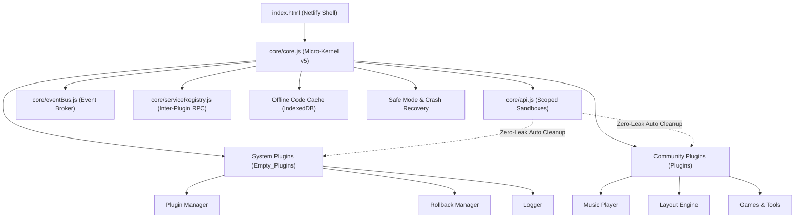
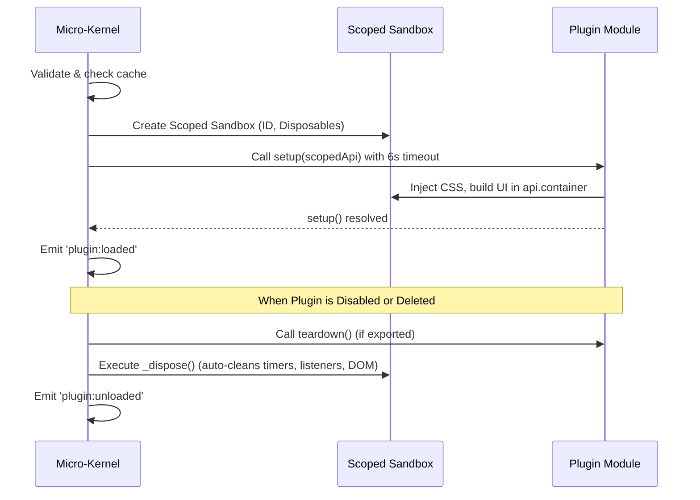

## Overview

Blank Board is designed around an **indestructible micro-kernel** architecture. The host application (`index.html` + `core/`) is a lightweight, ultra-stable container deployed to Netlify. All tools, widgets, themes, and even the Plugin Manager itself are loaded dynamically from GitHub as raw ES modules.


```mermaid
graph TD
    A["index.html (Netlify Shell)"] --> B["core/core.js (Micro-Kernel v5)"]
    B --> C["core/api.js (Scoped Sandboxes)"]
    B --> D["core/eventBus.js (Event Broker)"]
    B --> E["core/serviceRegistry.js (Inter-Plugin RPC)"]
    B --> F["Offline Code Cache (IndexedDB)"]
    B --> G["Safe Mode & Crash Recovery"]
    
    B --> H["System Plugins (Empty_Plugins)"]
    H --> H1["Plugin Manager"]
    H --> H2["Rollback Manager"]
    H --> H3["Logger"]
    
    B --> I["Community Plugins (Plugins)"]
    I --> I1["Music Player"]
    I --> I2["Layout Engine"]
    I --> I3["Games & Tools"]
    
    C -.->|Zero-Leak Auto Cleanup| H
    C -.->|Zero-Leak Auto Cleanup| I
```

---

## Core Pillars of the v5.0 Engine

### 1. Scoped Plugin Sandboxes
When a plugin loads, the core does not give it a shared, mutable API object. Instead, the core generates a dedicated **Scoped Sandbox instance** (`createPluginSandbox`):
- **Locked Container**: `api.container` is tied directly to the plugin's ID. There is no async race condition.
- **Zero-Leak Auto-Disposal**: Every event subscription (`api.bus.on`), hook registration (`api.registerHook`), keyboard shortcut (`api.registerShortcut`), timer (`api.setInterval`), and CSS stylesheet (`api.injectCSS`) is recorded in an internal disposal registry. When a plugin is toggled off or deleted, the core **automatically disposes 100% of its resources**.
- **Scoped Storage**: `api.storage.get()` and `api.storage.set()` automatically namespace keys under `plugin:{id}:{key}`.

---

### 2. Safe Mode & Crash Recovery
If an external plugin has a syntax error, infinite loop, or unhandled crash on startup:
1. **Manual Safe Mode**: Hold <kbd>Shift</kbd> during reload or add `?safemode=1` to the URL.
2. **Crash-Loop Auto-Guard**: The core tracks boot intervals in `sessionStorage`. If the board detects 2 rapid reloads in under 2.5 seconds, it automatically engages **Safe Mode**.
3. **Recovery Experience**: In Safe Mode, community plugins are paused, and only the **Plugin Manager** is booted with a prominent recovery banner allowing you to disable or fix the problematic plugin.

---

### 3. Offline Code Cache & Instant Startup
To eliminate GitHub raw latency and rate-limiting:
1. When a plugin is fetched, the core caches the raw JavaScript code in **IndexedDB** (`BlankBoardCodeCache`).
2. On subsequent page visits, the cached plugin code executes immediately with **0ms network delay**.
3. If an internet connection is available, the core checks for updates in the background (stale-while-revalidate) and refreshes the cache seamlessly.

---

### 4. Inter-Plugin Service Registry (`api.services`)
Beyond one-way events and flat hooks, the v5.0 core provides a centralized **Service Registry** for Inter-Plugin RPC:
- Plugins can register reusable engines (e.g. `audio-engine`, `physics-2d`, `syntax-highlighter`).
- Other plugins can consume these services asynchronously and safely.

```javascript
// Plugin A (Provider)
export function setup(api) {
  api.services.register('math-utils', {
    add: (a, b) => a + b,
    multiply: (a, b) => a * b
  });
}

// Plugin B (Consumer)
export function setup(api) {
  const math = api.services.get('math-utils');
  if (math) {
    console.log('Result:', math.add(10, 20)); // 30
  }
}
```

---

### 5. Hybrid Storage Engine
- **LocalStorage**: Ultra-fast key-value persistence for small settings, preferences, and window states.
- **IndexedDB (`api.storage.db`)**: Async key-value storage capable of storing hundreds of megabytes of binary blobs, audio tracks, canvas drawing buffers, and game save files without `QuotaExceededError`.

---

## The Plugin Lifecycle


```mermaid
sequenceDiagram
    participant K as Micro-Kernel
    participant S as Scoped Sandbox
    participant P as Plugin Module
    
    K->>K: Validate & check cache
    K->>S: Create Scoped Sandbox (ID, Disposables)
    K->>P: Call setup(scopedApi) with 6s timeout
    P->>S: Inject CSS, build UI in api.container
    P-->>K: setup() resolved
    K->>K: Emit 'plugin:loaded'
    
    Note over K,P: When Plugin is Disabled or Deleted
    K->>P: Call teardown() (if exported)
    K->>S: Execute _dispose() (auto-cleans timers, listeners, DOM)
    K->>K: Emit 'plugin:unloaded'
```

---

## Directory Structure

```
Empty/
├── Another/                    # Host Application (Netlify)
│   ├── index.html              # Static HTML shell & CSS tokens
│   └── core/
│       ├── core.js             # Micro-kernel v5 bootstrapper
│       ├── api.js              # Scoped sandbox factory & UI systems
│       └── eventBus.js         # Pub/sub event broker
├── Empty_Plugins/              # System Plugins (GitHub)
│   ├── plugin-manager.js       # Community Store & Workspace Manager
│   ├── rollback-manager.js     # Version Snapshot & Rollback Engine
│   ├── logger.js               # Lifecycle Telemetry & Event Inspector
│   └── plugins.json            # Official Registry Catalog
├── Plugins/                    # Community Plugins (GitHub)
│   ├── music-player.js         # Audio player & playlist
│   ├── layout.js               # Column docking & grid engine
│   └── ... (27+ widgets)
└── Documentations/             # Mintlify Documentation Site
```
