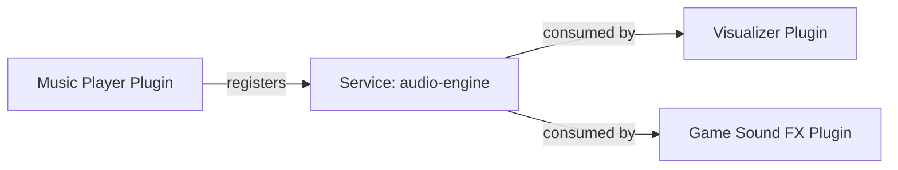

## Overview

While the **Event Bus** (`api.bus`) is designed for fire-and-forget messaging and **Hooks** (`api.registerHook`) collect return arrays, the **Service Registry** (`api.services`) enables plugins to export and consume structured, type-safe API services.

This allows plugins to act as core engines (e.g. audio synthesis, 2D physics, markdown parsing, syntax highlighting) that other plugins can seamlessly interact with.



---

## Registering a Service

To provide a service to other plugins, call `api.services.register(serviceName, instance)` during `setup()`:

```javascript
export const meta = {
  id: 'sound-fx-engine',
  name: 'Sound FX Engine',
  version: '1.0.0'
};

export function setup(api) {
  const audioCtx = new (window.AudioContext || window.webkitAudioContext)();

  // Register the sound effects service
  api.services.register('sfx', {
    playBeep(freq = 440, duration = 0.2) {
      const osc = audioCtx.createOscillator();
      const gain = audioCtx.createGain();
      osc.frequency.value = freq;
      osc.connect(gain);
      gain.connect(audioCtx.destination);
      osc.start();
      gain.gain.exponentialRampToValueAtTime(0.0001, audioCtx.currentTime + duration);
      osc.stop(audioCtx.currentTime + duration);
    },
    playExplosion() {
      // Custom audio logic
    }
  });
}
```

<Info>
  **Automatic Unregistration:** When your plugin is unloaded, the core automatically unregisters all services registered by your plugin.
</Info>

---

## Consuming a Service

To consume a service provided by another plugin, use `api.services.get(serviceName)`:

```javascript
export const meta = {
  id: 'space-invaders-game',
  name: 'Space Invaders',
  version: '1.0.0'
};

export function setup(api) {
  const container = api.container;
  container.innerHTML = `<button id="fire-btn">Fire Laser</button>`;

  container.querySelector('#fire-btn').addEventListener('click', () => {
    // Check if the sound service is available
    if (api.services.has('sfx')) {
      const sfx = api.services.get('sfx');
      sfx.playBeep(880, 0.1);
    } else {
      console.log('Sound FX engine not installed');
    }
  });
}
```

---

## Service Lifecycle Events

The core emits lifecycle events when services are added or removed:

```javascript
// Listen when a service becomes available
api.bus.on('service:registered', ({ name, pluginId }) => {
  if (name === 'audio-engine') {
    console.log(`Audio engine ready from plugin ${pluginId}`);
  }
});

// Listen when a service is unregistered
api.bus.on('service:unregistered', ({ name, pluginId }) => {
  if (name === 'audio-engine') {
    console.log('Audio engine unloaded');
  }
});
```
